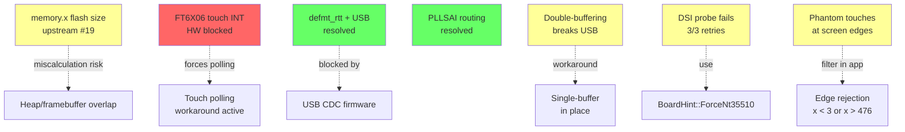

# Known Issues

Hardware and software issues affecting the STM32F469I-DISCOVERY board and this BSP. Each entry includes status, impact, and where applicable, a workaround.

> Cross-reference: [embassy-stm32f469i-disco/docs/known-issues.md](https://github.com/Amperstrand/embassy-stm32f469i-disco/blob/main/docs/known-issues.md) covers issues specific to the async Embassy BSP.

## Issue Dependency Map



---

## Active Issues

### memory.x flash size mismatch

- **Status**: Open
- **Upstream**: [Amperstrand/embassy-stm32f469i-disco#19](https://github.com/Amperstrand/embassy-stm32f469i-disco/issues/19)
- **Impact**: Firmware linked against wrong flash size. The STM32F469NIHx has 2048K flash, but `memory.x` in the Embassy BSP declares only 1024K.
- **Workaround**: This sync BSP uses its own linker script with the correct 2048K value. The mismatch only affects the Embassy BSP.

### Heap/framebuffer overlap

- **Status**: Documented
- **Impact**: Allocator metadata corruption if framebuffer size is miscalculated.
- **Details**: `DisplayOrientation::fb_size()` returns the number of pixels (384,000 for 480x800), not bytes. The framebuffer uses `u32` (4 bytes per pixel, ARGB8888), so the actual allocation is `fb_size() * 4` (1,536,000 bytes). The heap offset must account for this, or allocator metadata gets overwritten by display writes.
- **Related**: The root cause of the memory.x issue above is that incorrect flash size assumptions can push the heap start into the wrong region.

### FT6X06 touch interrupt not routed

- **Status**: Hardware blocked
- **Impact**: Touch input requires polling instead of interrupt-driven wakeups, wasting CPU cycles and increasing latency.
- **Details**: The FT6X06 INT pin is not routed to any MCU GPIO on the STM32F469I-Discovery board. There is no software fix. The BSP's `touch` module polls the controller over I2C on every read.
- **Future**: A board redesign should route FT6X06 INT to a configurable EXTI-capable GPIO.

### DSI probe fails on all retries

- **Status**: Open (workaround available)
- **Impact**: `BoardHint::Auto` I2C panel detection fails 3/3 retries on some boards, falling back to `NT35510` for inconclusive results.
- **Workaround**: Use `BoardHint::ForceNt35510` to skip the probe entirely. DSI writes work fine and the display renders correctly regardless of probe result. This is the recommended default for production firmware.

### FT6X06 phantom touches at screen edges

- **Status**: Documented (hardware limitation)
- **Impact**: The FT6X06 reports phantom touch events at screen edges (x=0, y=445, x=479, y=767). This is electrical noise picked up by the capacitive sensor, not a driver bug.
- **Workaround**: Apply edge rejection in application code:
  ```rust
  if x < 3 || x > 476 || y < 3 || y > 796 {
      return None; // reject edge touches
  }
  ```
  The BSP does not apply this filter internally. Consumers must implement their own edge rejection logic.

### Double-buffering breaks USB

- **Status**: Open (workaround in place)
- **Impact**: Using LTDC `set_layer_buffer_address` with `reload_on_vblank` creates a race condition that breaks USB DMA transfers.
- **Workaround**: Use a single framebuffer. Both BSPs (sync and async) ship with single-buffer configurations.

---

## Resolved Issues

### defmt_rtt prevents USB enumeration

- **Status**: Resolved
- **Impact**: `defmt_rtt` (even unused via `use defmt_rtt as _`) prevented USB OTG FS from enumerating.
- **Root cause**: Two interacting problems. First, `defmt_rtt` uses `critical_section::acquire()` which disables all interrupts including USB OTG, breaking enumeration timing (RM0090 32.4.4). Second, probe-rs hardcodes blocking mode for RTT; if the buffer fills during enumeration, `flush()` busy-waits with interrupts disabled.
- **Fix**: Never use `defmt_rtt` or `panic_probe` in firmware that enables USB CDC. Use `panic_halt` for production builds. The BSP's `defmt` feature gate is now correctly isolated from the unconditional feature list.
- **Reference**: [stm32f469i-disc#23](https://github.com/Amperstrand/stm32f469i-disc/issues/23), [embassy-rs/embassy#2823](https://github.com/embassy-rs/embassy/pull/2823)

### PLLSAI clock routing confusion

- **Status**: Resolved
- **Impact**: The `CK48SEL=PLLSAI1_Q` enum is misleading on STM32F469. Hardware actually routes PLLSAI_P to the 48MHz clock mux, not PLLSAI_Q.
- **Details**: At 180MHz SYSCLK, PLL1 cannot produce a clean 48MHz USB clock. The 48MHz must come from PLLSAI. The correct configuration uses `divp: DIV8` (384MHz / 8 = 48MHz) and selects `PLLSAI1_Q` in the mux enum, despite the hardware routing PLLSAI_P. A `DCKCFGR2` workaround is required because embassy writes to the wrong register.
- **Reference**: [embassy-stm32f469i-disco#14](https://github.com/Amperstrand/embassy-stm32f469i-disco/issues/14)

### Cargo.toml defmt feature gate leak

- **Status**: Fixed (commit `bb5dc75`)
- **Impact**: `"defmt"` was unconditionally present in `stm32f4xx-hal` features, making the `defmt` feature gate useless. Downstream consumers using `default-features = false` without `defmt` still got defmt compiled in.
- **Fix**: Removed `"defmt"` from the unconditional features list. The `defmt` feature gate still adds it when explicitly enabled.
- **Reference**: [issue #24](https://github.com/Amperstrand/stm32f469i-disc/issues/24)

---

## Testing Notes

USB CDC timing is sensitive to debug probe interference. probe-rs halts the CPU periodically for RTT reads, which breaks USB enumeration and data transfer. For USB testing, always use `st-flash --connect-under-reset` instead of probe-rs. See [USB-GUIDE.md](USB-GUIDE.md) for the full procedure.

## Related Documentation

- [AGENTS.md](../AGENTS.md) -- full hardware test evidence and BSP architecture
- [USB-GUIDE.md](USB-GUIDE.md) -- USB OTG FS setup and CDC-ACM troubleshooting
- [DISPLAY-PIXEL-FORMATS.md](DISPLAY-PIXEL-FORMATS.md) -- RGB565 vs ARGB8888 tradeoffs
- [embassy-stm32f469i-disco](https://github.com/Amperstrand/embassy-stm32f469i-disco) -- async BSP with its own known issues
